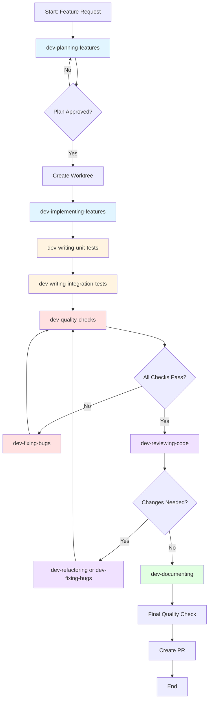

# AI SDLC Skills for AI Coding Tools

This repository contains a comprehensive suite of skills and workflows for AI-powered software development. Compatible with:

- **Claude Code** (Anthropic's CLI)
- **Cursor** (AI-powered editor)
- **Gemini CLI** (Google's command-line AI)
- **Antigravity** (Google's AI IDE)

Skills are systematic, phase-based workflows that guide AI through complex development tasks with built-in best practices and progress tracking.

## What Are Skills?

Skills are structured workflows that AI coding tools automatically discover and use when relevant. Each skill:
- **Phase-based workflow** (5-8 phases) with clear progression
- **TodoWrite integration** for tracking progress through phases
- **Comprehensive references** with detailed examples and best practices
- **Templates** for consistent outputs
- **≤ 500 lines** in main file (details extracted to references)

Skills are **automatically invoked** when their description matches the task at hand - no manual command needed!

## Getting Started

### Prerequisites

- **Git:** [Installation Guide](https://git-scm.com/downloads)
- **One or more AI coding tools:**
  - [Claude Code](https://marketplace.visualstudio.com/items?itemName=anthropic.claude-vscode) (VS Code extension)
  - [Cursor](https://cursor.com)
  - [Gemini CLI](https://github.com/google-gemini/gemini-cli)
  - [Antigravity](https://antigravityai.directory)
### Quick Installation (Recommended)

Use the setup script to automatically configure skills for your AI tools:

```bash
# Clone the repository
git clone https://github.com/Brain-Bridge-AI/ai-sdlc.git
cd ai-sdlc

# Install for all supported tools + utilities
python setup.py --all

# Or install for specific tools
python setup.py --claude --gemini

# Install just utility scripts to ~/bin
python setup.py --utilities

# Preview what will be installed
python setup.py --dry-run --all

# Check current installation status
python setup.py --status

# Uninstall
python setup.py --uninstall
```

### Tool Configuration Locations

The setup script creates symlinks (or copies for tools that don't support symlinks) to the following locations:

| Tool | Skills/Rules Location | Commands/Workflows Location |
|------|----------------------|-------------------|
| **Claude Code** | `~/.claude/skills/` | `~/.claude/commands/` |
| **Cursor** | `.cursor/rules/` (project) | N/A |
| **Gemini CLI** | N/A | `~/.gemini/commands/` |
| **Antigravity** | `~/.gemini/antigravity/skills/` | `~/.gemini/antigravity/global_workflows/` |
| **Utilities** | N/A | `~/bin/` (pull-env, wt) |
| **Claude Hooks** | `~/.claude/settings.json` | N/A |
| **Claude Plugins** | `~/.claude/plugins/` | N/A |

**Note:** Antigravity does NOT follow symlinks for security reasons. The setup script copies files instead of creating symlinks for Antigravity.

### Manual Installation (Claude Code Only)

If you prefer manual installation for Claude Code:

```bash
# Clone the repository
git clone https://github.com/Brain-Bridge-AI/ai-sdlc.git
cd ai-sdlc

# Install skills
mkdir -p ~/.claude/skills
ln -s $(pwd)/skill-creator ~/.claude/skills/
ln -s $(pwd)/dev-* ~/.claude/skills/
ln -s $(pwd)/infra-* ~/.claude/skills/

# Install commands
mkdir -p ~/.claude/commands
ln -s $(pwd)/*.md ~/.claude/commands/
```

Restart your AI tool to load the skills.

## Skills-Based SDLC Workflow

The skills-based workflow provides a systematic approach to development with AI assistance at every phase. Skills are **automatically invoked** based on your request.

### Workflow Diagram



### Development Skills Suite

#### 🎯 Planning & Architecture

**dev-planning-features**
- Comprehensive feature planning with technical design
- Architectural review and feasibility analysis
- Database schema design, API design, testing strategy
- **When to use:** "Plan a user authentication feature"
- **Phases:** Requirements → Research → Database → API → Testing → Edge Cases → Final Plan

#### 🔨 Implementation

**dev-implementing-features**
- Systematic feature implementation workflow
- Follows established patterns and conventions
- Integrates with existing architecture
- **When to use:** "Implement the user authentication feature"
- **Phases:** Review Plan → Setup → Implement Core → Validation → Error Handling → Verify → Commit

**dev-fixing-bugs**
- Root cause analysis using scientific method
- Systematic bug investigation and resolution
- Test-driven bug fixing approach
- **When to use:** "Fix the login authentication bug"
- **Phases:** Reproduce → Investigate → Generate Hypotheses → Test Hypotheses → Implement Fix → Validate → Document

#### 🧪 Testing

**dev-writing-unit-tests**
- AAA pattern (Arrange-Act-Assert)
- 90%+ coverage target with meaningful tests
- Test isolation with transaction rollback
- **When to use:** "Write unit tests for the authentication service"
- **Phases:** Analyze → Design → Write Tests → Verify Coverage → Review Quality → Document

**dev-writing-integration-tests**
- Docker-based test environments
- External service integration testing
- Tagged with `@pytest.mark.integration`
- **When to use:** "Write integration tests for the login flow"
- **Phases:** Analyze → Design → Setup Environment → Write Tests → Verify → Review → Document

#### ✅ Quality Assurance

**dev-quality-checks**
- Streamlined quality validation leveraging Stop hook automation
- **Automated by Stop hook:** Unit tests, type checking, linting, formatting (runs every turn)
- **Manual checks:** Integration tests, security scanning (bandit), user validation
- **When to use:** "Run all quality checks before creating the PR"
- **Phases:** Verify Stop Hook → Integration Tests → Security Scanning → User Validation

**dev-reviewing-code**
- Comprehensive 7-dimension code review
- Reviews: Correctness, Security, Quality, Performance, Testing, Standards, Architecture
- Prioritized feedback (Critical → Important → Suggestions)
- **When to use:** "Review pull request #123"
- **Phases:** Fetch PR → Verify Checks → High-Level Review → Detailed Review → Provide Feedback → Make Decision → Follow-Up

#### 🔧 Maintenance & Improvement

**dev-refactoring**
- Incremental refactoring (not revolutionary)
- Addresses AI-generated code duplication
- Priority scoring: (Frequency × 2) + Complexity + Bug
- **When to use:** "Refactor the order processing module to reduce complexity"
- **Phases:** Identify Opportunities → Prioritize → Ensure Tests → Refactor Incrementally → Address AI Duplication → Verify Quality → Document

**dev-documenting**
- README, Google-style docstrings, API documentation
- Validates all examples work
- AI-assisted generation with human review
- **When to use:** "Document the authentication module"
- **Phases:** Identify Needs → Generate Docstrings → Create README → API Docs → Usage Examples → Validate → Create PR

#### 🛠️ Meta Skills

**skill-creator** *(Anthropic official, Apache 2.0)*
- Creates, tests, and iteratively improves Claude Code skills
- Built-in evals with quantitative assertions and benchmark mode
- Blind A/B comparison via subagent grader, comparator, and analyzer
- Description optimization loop for better skill triggering
- HTML eval viewer for human review with feedback collection
- **When to use:** "Create a new skill for database migrations" or "Improve my existing skill"

**dev-mcp-builder**
- Guide for creating MCP (Model Context Protocol) servers in Python
- Enables LLMs to interact with external services via FastMCP + Lambda
- Deploys to AWS via CDK with AgentCore Gateway integration
- **When to use:** "Build an MCP server to integrate with Jira"

**dev-changelog-generator**
- Automatically creates user-facing changelogs from git commits
- Analyzes commit history and categorizes changes
- Transforms technical commits into customer-friendly release notes
- **When to use:** "Generate a changelog for the latest release"

#### ☁️ Infrastructure

**infra-cdk-quality**
- Evaluates AWS CDK code for stack interdependencies and security
- Detects cross-stack reference issues that cause deployment deadlocks
- Runs cdk-nag, Checkov, and cfn-lint scanning with remediation guidance
- Includes multi-customer deployment script patterns and validation
- **When to use:** "Review the CDK code for quality issues" or "Create a deploy.sh script"
- **Phases:** Project Setup → Stack Architecture → Dependency Detection → Security Scanning → Best Practices → Remediation → Deployment Scripts

### Step-by-Step: Feature Development

Here's how to use the skills for complete feature development:

1. **Plan the Feature**
   ```
   "Plan a user authentication feature with JWT tokens"
   ```
   → Automatically invokes `dev-planning-features` skill

2. **Create Worktree**
   ```
   /worktree auth-feature
   ```

3. **Implement the Feature**
   ```
   "Implement the user authentication feature according to the plan"
   ```
   → Automatically invokes `dev-implementing-features` skill

4. **Write Tests**
   ```
   "Write unit tests for the authentication service"
   "Write integration tests for the login endpoint"
   ```
   → Automatically invokes `dev-writing-unit-tests` and `dev-writing-integration-tests` skills

5. **Run Quality Checks**
   ```
   "Run all quality checks"
   ```
   → Automatically invokes `dev-quality-checks` skill

6. **Fix Any Issues**
   ```
   "Fix the failing authentication test"
   ```
   → Automatically invokes `dev-fixing-bugs` skill

7. **Document the Feature**
   ```
   "Document the authentication module"
   ```
   → Automatically invokes `dev-documenting` skill

8. **Final Quality Check & Commit**
   ```
   "Run quality checks and commit"
   ```
   → Uses `dev-quality-checks` + `/commit`

9. **Create Pull Request**
   ```
   "Create a pull request for this feature"
   ```
   → Creates PR with comprehensive description

10. **Code Review** (done by another developer using Claude)
    ```
    "Review pull request #123"
    ```
    → Automatically invokes `dev-reviewing-code` skill

## Slash Commands

In addition to skills, this repository includes slash commands for specific common tasks:

### Workflow Commands

| Command | Description |
| --- | --- |
| `/fix-bug` | Bug fix workflow with root cause analysis and TDD |
| `/plan-feature` | Feature planning workflow with architectural review |
| `/quality-check` | Run integration tests, security scan, and user validation |
| `/test` | Run all quality checks for the codebase |
| `/troubleshoot-01` | Root cause analysis phase (diagnosis only) |
| `/troubleshoot-02` | Implement fix after diagnosis |

### Git & Project Commands

| Command | Description |
| --- | --- |
| `/commit-only` | Commits changes without running quality checks |
| `/commit` | Runs quality checks and commits changes |
| `/commit_push_pr` | Quality checks, commit, push, and create PR |
| `/squashed` | Removes a merged branch and cleans up worktree |
| `/worktree` | Creates a new git worktree using the `wt` script |

### Roadmap Commands

| Command | Description |
| --- | --- |
| `/roadmap-plan-01` | Create a detailed plan for a roadmap item |
| `/roadmap-plan-02-architect` | Architectural review of a plan file |
| `/roadmap-plan-03-tests` | Generate test scenarios from a plan |
| `/roadmap-execute` | Execute a roadmap plan file with TDD |

### Utility Commands

| Command | Description |
| --- | --- |
| `/new-project` | Sets up a new Python development project |
| `/prime` | Primes the model with core project documentation |
| `/question` | Answers questions about the codebase |
| `/audit-aws-security` | Step-by-step AWS security audit guide |

## Scripts

### `setup.py`

Platform-agnostic setup script that configures AI SDLC for multiple AI coding tools. Creates symlinks (or copies for Antigravity), generates tool-specific configuration files, and installs utility scripts. Works on macOS, Linux, and Windows with no external dependencies beyond Python 3.

```bash
python setup.py --all           # Install for all tools + utilities
python setup.py --claude        # Claude Code only
python setup.py --gemini        # Gemini CLI only
python setup.py --antigravity   # Antigravity only
python setup.py --utilities     # Install utilities to ~/bin only
python setup.py --status        # Check installation status
python setup.py --uninstall     # Remove all installations
python setup.py --dry-run --all # Preview without changes
```

### `scripts/wt.sh` (installed as `wt`)

Creates a new git worktree for a feature branch. Used by the `/worktree` command.

**Usage:**
```bash
wt <feature_name>
```

### `scripts/pull_customer_env.py` (installed as `pull-env`)

Pulls secrets from AWS Secrets Manager and generates `.env` files. Auto-discovers secrets based on customer (AWS profile) and optional application filter.

**Usage:**
```bash
# Pull all secrets for a customer
pull-env -c fstaff -o .env

# Pull secrets for a specific application
pull-env -c fstaff -a ai-teammate -o .env

# Dry run - see what would be fetched
pull-env -c fstaff --dry-run
```

**Windows Users:** Use [Git Bash](https://gitforwindows.org/) or [WSL](https://learn.microsoft.com/en-us/windows/wsl/install) to run bash scripts.

## Claude Code Hooks

The setup script configures Claude Code hooks for automatic Python quality checks. This eliminates redundant manual quality checks from workflows - skills and commands now focus only on integration tests, security scanning, and user validation.

### PostToolUse Hooks (Per-File)

After every `Edit`, `Write`, or `MultiEdit` operation on a Python file:
- **Ruff format** - Auto-formats the file
- **Ruff check** - Lints and auto-fixes issues

These run on the specific file being edited for fast feedback.

### Stop Hook (End of Turn)

At the end of each Claude Code turn, runs comprehensive project-wide checks:
- **Ruff format** - Project-wide formatting
- **Ruff check** - Project-wide linting with auto-fix
- **Mypy** - Project-wide type checking (if available)
- **Pytest** - Unit tests only (`-m "not integration"`)

**Note:** Integration tests are NOT run by the Stop hook because they require `.env` sourcing and may involve external services.

### Installation

Hooks are installed automatically to `~/.claude/settings.json` by the setup script:

```bash
./setup-ai-sdlc.sh --claude
```

This configures hooks at the **user level**, so they apply to all your Claude Code sessions across projects. The hooks only activate when working in Python projects (they check for `.py` files and `pyproject.toml`/`setup.py`).

### Hook Scripts

| Script | Purpose | Trigger |
|--------|---------|---------|
| `python_lint_improved.sh` | Per-file linting/formatting | PostToolUse (Edit/Write) |
| `python_quality_check.sh` | Project-wide quality checks | Stop (end of turn) |

These scripts are symlinked to `~/bin/` and receive JSON input from Claude Code via stdin.

## Ralph Wiggum Plugin

The setup script also installs the **Ralph Wiggum** plugin - an autonomous development loop technique from Anthropic's official Claude Code plugins.

### What is Ralph Wiggum?

As Geoffrey Huntley describes it: "Ralph is a Bash loop" - a continuous feedback mechanism where Claude autonomously refines work across multiple iterations. The plugin uses a Stop hook to intercept session exits, re-feeding the same prompt back to Claude until a completion condition is met.

### Commands

| Command | Description |
|---------|-------------|
| `/ralph-wiggum:ralph-loop` | Start an autonomous iteration loop |
| `/ralph-wiggum:cancel-ralph` | Stop an active loop |

### Usage

```bash
# Start a loop with max iterations and completion promise
/ralph-wiggum:ralph-loop "Build a todo API" --completion-promise "DONE" --max-iterations 20

# Start an infinite loop (be careful!)
/ralph-wiggum:ralph-loop "Refactor the cache layer"
```

To signal completion, output: `<promise>YOUR_COMPLETION_TEXT</promise>`

### Best Use Cases

- Batch operations and large refactors
- Test coverage improvements
- Documentation generation
- Tasks with clear, measurable success criteria

### Installation

The plugin is installed via the Claude Code CLI from the [Anthropic marketplace](https://github.com/anthropics/claude-code/tree/main/plugins/ralph-wiggum). The setup script automatically:
1. Adds the Anthropic plugin marketplace
2. Installs the ralph-wiggum plugin

This ensures you always get the latest version and proper CLI integration.

## Skill Validation

Skills can be validated using Anthropic's quick_validate script:

```bash
cd ~/.claude/skills
python3 skill-creator/scripts/quick_validate.py your-skill-name/SKILL.md
```

**Checks:**
- SKILL.md ≤ 500 lines
- Proper frontmatter (name, description)
- Valid YAML structure

## Research Foundation

This skills suite is based on comprehensive research of AI SDLC best practices for 2025:

- **97.5% of companies** use AI in software development
- **AI-assisted code review** catches 85% more issues than manual review alone
- **40% of developers** spend 2-5 days/month on technical debt
- **AI generates 35%+ of code** → requires systematic duplication prevention
- **45% of AI-generated code** fails security tests without proper scanning

## Contributing

To create a new skill:

1. Use the `skill-creator` skill:
   ```
   "Create a skill for database migrations"
   ```
   The skill-creator guides you through drafting, testing with evals, benchmarking, and iteratively improving skills.

2. Validate before committing:
   ```bash
   python3 skill-creator/scripts/quick_validate.py your-skill-name/SKILL.md
   ```

## License

MIT License - see LICENSE file for details.

## Support

- **Issues:** https://github.com/Brain-Bridge-AI/ai-sdlc/issues
- **Documentation:** See individual skill `SKILL.md` files and `references/` directories
