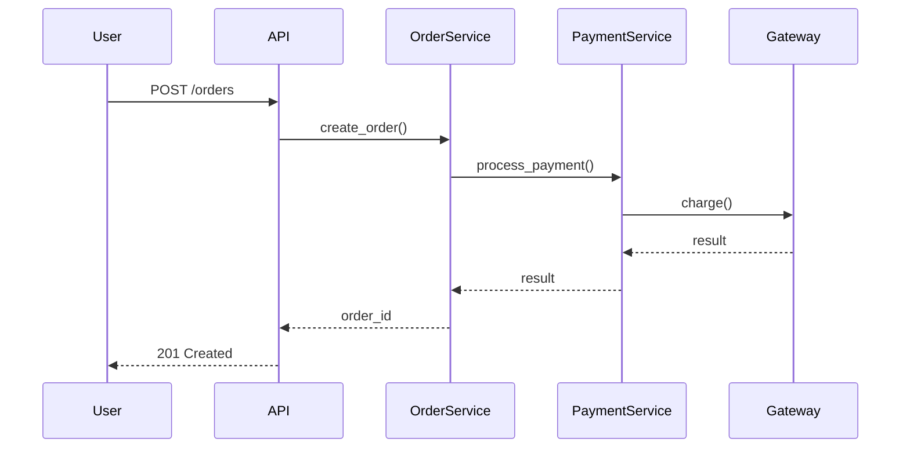

# Documentation Standards Reference

This document details what makes good documentation and how to create it effectively.

## Overview

**Research finding:** "AI can generate better documentation for a 15-year-old module in an hour than the original developer wrote in six months."

**Good documentation:**
- Helps users understand how to use the code
- Helps developers understand how to maintain the code
- Reduces onboarding time for new team members
- Prevents knowledge loss when team members leave

**Types of documentation:**
1. **README** - Project overview and getting started
2. **API Documentation** - Function/class references
3. **Docstrings** - Inline function documentation
4. **Architecture Documentation** - System design and decisions
5. **Usage Examples** - How to accomplish common tasks
6. **Migration Guides** - How to upgrade between versions

---

## README Documentation

### Purpose

READMEs are the first thing users see. They should answer:
- What does this project do?
- Why should I use it?
- How do I get started?
- Where can I learn more?

### README Structure

```markdown
# Project Name

Brief one-sentence description.

## Overview

1-2 paragraph explanation of what this project does and why it exists.

## Features

- Key feature 1
- Key feature 2
- Key feature 3

## Installation

```bash
# Installation commands
pip install package-name
```

## Quick Start

```python
# Minimal example to get started
from package import MainClass

client = MainClass()
result = client.do_something()
```

## Usage

### Common Task 1

```python
# Example code showing how to do task 1
```

### Common Task 2

```python
# Example code showing how to do task 2
```

## Configuration

Explain configuration options:

| Variable | Description | Default |
|----------|-------------|---------|
| API_KEY | Your API key | Required |
| TIMEOUT | Request timeout (seconds) | 30 |

## Development

### Setup Development Environment

```bash
# Commands to set up for development
git clone ...
uv sync
```

### Running Tests

```bash
pytest
```

### Contributing

Link to CONTRIBUTING.md or explain contribution process.

## Documentation

Link to full documentation if it exists elsewhere.

## License

License information.

## Support

How to get help (issues, email, Slack, etc.)
```

### README Best Practices

**✓ Do:**
- Start with what it does (not how to install)
- Provide working code examples
- Keep examples minimal (not entire applications)
- Update when functionality changes
- Use screenshots/diagrams if helpful

**❌ Don't:**
- Assume prior knowledge
- Use jargon without explanation
- Provide examples that don't work
- Leave outdated information
- Make it too long (link to full docs instead)

---

## API Documentation

### Purpose

API documentation explains:
- What functions/classes do
- What parameters they accept
- What they return
- What exceptions they raise
- How to use them (examples)

### Docstring Standard (Google Style)

**Function docstring:**
```python
def calculate_discount(price: float, discount_rate: float) -> float:
    """Calculate discounted price.

    Applies a percentage discount to the original price.

    Args:
        price: Original price in dollars. Must be positive.
        discount_rate: Discount as decimal (0.0 to 1.0).
                       0.2 represents 20% discount.

    Returns:
        Final price after discount is applied.

    Raises:
        ValueError: If price is negative or discount_rate not in 0-1 range.

    Examples:
        >>> calculate_discount(100.0, 0.2)
        80.0

        >>> calculate_discount(50.0, 0.1)
        45.0

    Note:
        Discount rate must be between 0 and 1. A rate of 0.2 means 20% off.
    """
    if price < 0:
        raise ValueError("Price cannot be negative")
    if not 0 <= discount_rate <= 1:
        raise ValueError("Discount rate must be between 0 and 1")

    return price * (1 - discount_rate)
```

**Class docstring:**
```python
class PaymentProcessor:
    """Process payments for orders.

    This class handles payment processing through various payment gateways.
    It validates payment information, processes charges, and handles failures.

    Attributes:
        gateway: Payment gateway instance (Stripe, PayPal, etc.)
        retry_attempts: Number of times to retry failed payments (default: 3)

    Examples:
        >>> processor = PaymentProcessor(gateway=StripeGateway())
        >>> result = processor.process_payment(order, payment_method)
        >>> print(result.status)
        'completed'

    Note:
        Payment processor requires valid API credentials in environment variables:
        - STRIPE_API_KEY for Stripe gateway
        - PAYPAL_CLIENT_ID and PAYPAL_SECRET for PayPal gateway
    """

    def __init__(self, gateway: PaymentGateway, retry_attempts: int = 3):
        """Initialize payment processor.

        Args:
            gateway: Payment gateway to use for processing
            retry_attempts: Number of retry attempts for failed payments

        Raises:
            ValueError: If retry_attempts is negative
        """
        if retry_attempts < 0:
            raise ValueError("Retry attempts cannot be negative")

        self.gateway = gateway
        self.retry_attempts = retry_attempts
```

### Docstring Best Practices

**✓ Do:**
- Start with one-line summary (< 80 chars)
- Explain WHY and WHAT, not just HOW
- Document all parameters and return values
- Include examples that work
- Document exceptions that can be raised
- Explain edge cases and constraints
- Use proper type hints (documentation in types)

**❌ Don't:**
- Just repeat parameter names
- Describe implementation details
- Leave parameters undocumented
- Skip return value documentation
- Forget about exceptions
- Write misleading examples

**Bad docstring:**
```python
def process(data):
    """Process data."""  # Useless - says nothing
    ...
```

**Good docstring:**
```python
def process_order_payment(order: Order) -> PaymentResult:
    """Process payment for order and update order status.

    Validates order totals, charges the payment method, and updates
    order status to 'paid' if successful or 'payment_failed' if declined.

    Args:
        order: Order to process payment for. Must have valid payment_method.

    Returns:
        PaymentResult with status ('completed' or 'failed') and transaction_id.

    Raises:
        ValueError: If order is missing payment method
        PaymentGatewayError: If payment gateway is unreachable

    Examples:
        >>> order = Order(user=user, items=[item], payment_method=card)
        >>> result = process_order_payment(order)
        >>> print(result.status)
        'completed'

    Note:
        This function is idempotent - calling it multiple times with the
        same order will not result in duplicate charges.
    """
    ...
```

---

## Code Comments

### When to Comment

**✓ Comment when:**
- Explaining WHY, not WHAT (code shows what)
- Non-obvious business logic
- Complex algorithms
- Workarounds or hacks
- Performance optimizations
- Security considerations

**❌ Don't comment when:**
- Code is self-explanatory
- Just rephrasing code in English
- Documenting obvious things

**Bad comments:**
```python
# Increment count by 1
count += 1

# Check if user is admin
if user.is_admin:
    ...

# Loop through items
for item in items:
    ...
```

**Good comments:**
```python
# Use exponential backoff to avoid overwhelming the API during retries
# Doubles wait time after each failure: 1s, 2s, 4s, 8s
wait_time = 2 ** attempt_number

# HACK: The payment gateway returns "Success" (capital S) for successful
# transactions but "success" (lowercase) for test transactions.
# Normalize to lowercase for consistency. Remove when gateway fixes this.
status = gateway_response.status.lower()

# Critical: Orders must be locked before processing to prevent
# duplicate charges if two workers process the same order concurrently
with order.lock():
    process_payment(order)
```

### Comment Best Practices

**WHY not WHAT:**
```python
# ❌ BAD: Describes WHAT
# Set price to 0
price = 0

# ✓ GOOD: Explains WHY
# Free tier users don't pay for basic features
price = 0
```

**Explain business logic:**
```python
# ✓ GOOD
# Sales tax applies only to orders shipping within California
# due to nexus requirements (physical warehouse in CA)
if order.shipping_address.state == "CA":
    order.total += order.subtotal * CA_SALES_TAX_RATE
```

**Document edge cases:**
```python
# ✓ GOOD
# Special handling for orders placed during daylight savings transition
# Orders between 2-3 AM on DST day need timezone adjustment
if is_dst_transition_hour(order.created_at):
    order.created_at = adjust_for_dst(order.created_at)
```

---

## Architecture Documentation

### Purpose

Architecture documentation explains:
- System design and structure
- Key components and their responsibilities
- How components interact
- Important design decisions and tradeoffs

### Architecture Document Structure

```markdown
# System Architecture

## Overview

High-level description of the system.

## Components

### Component 1: User Service

**Responsibility:** Manages user accounts, authentication, and profiles.

**Key Classes:**
- `UserService`: Main entry point
- `AuthenticationService`: Handles login/logout
- `UserRepository`: Database access layer

**Dependencies:**
- PostgreSQL database
- Redis for session storage
- Email service for verification

### Component 2: Order Service

**Responsibility:** Processes orders and manages inventory.

...

## Data Flow



## Key Design Decisions

### Decision: Microservices vs Monolith

**Decision:** Monolithic architecture initially

**Reasoning:**
- Team is small (< 10 people)
- Microservices add complexity we don't need yet
- Can refactor to microservices later if needed

**Tradeoffs:**
- Pro: Simpler deployment, easier development
- Con: All services must scale together

**Date:** 2024-01-15
**Status:** Current

### Decision: SQL vs NoSQL

**Decision:** PostgreSQL (SQL)

**Reasoning:**
- Strong consistency requirements for orders/payments
- Complex queries for reporting
- ACID transactions essential

**Alternatives considered:**
- MongoDB: Too loose for financial data
- DynamoDB: Overkill for current scale

**Date:** 2024-01-20
**Status:** Current

## Security Considerations

- All external APIs use OAuth 2.0
- Passwords hashed with bcrypt
- SQL injection prevented via parameterized queries
- Rate limiting on all public endpoints

## Scalability

**Current capacity:** 1000 orders/day

**Bottlenecks:**
- Database queries (can add read replicas)
- Payment gateway API rate limits

**Scaling plan:**
- Phase 1 (< 10K orders/day): Add database read replicas
- Phase 2 (< 100K orders/day): Cache layer (Redis)
- Phase 3 (100K+ orders/day): Consider microservices
```

---

## Usage Examples

### Purpose

Usage examples show how to accomplish common tasks. They're more practical than API reference.

### Example Structure

```markdown
# Usage Examples

## Common Task 1: Creating a New User

```python
from app.services import UserService

# Initialize service
user_service = UserService()

# Create user
user = user_service.create_user(
    username="john_doe",
    email="john@example.com",
    password="secure_password"
)

# Send verification email
user_service.send_verification_email(user)
```

## Common Task 2: Processing an Order

```python
from app.services import OrderService, PaymentService

# Create order
order = OrderService.create_order(
    user_id=user.id,
    items=[
        {"product_id": 123, "quantity": 2},
        {"product_id": 456, "quantity": 1},
    ]
)

# Process payment
payment_service = PaymentService()
result = payment_service.process_payment(
    order=order,
    payment_method=user.default_payment_method
)

if result.status == "completed":
    print(f"Order {order.id} completed!")
else:
    print(f"Payment failed: {result.error_message}")
```

## Common Task 3: Handling Errors

```python
from app.services import UserService
from app.exceptions import UserAlreadyExistsError, InvalidEmailError

try:
    user = UserService().create_user(
        username="john_doe",
        email="invalid-email",
        password="password"
    )
except InvalidEmailError:
    print("Please provide a valid email address")
except UserAlreadyExistsError:
    print("Username already taken")
```
```

---

## Migration Guides

### Purpose

Migration guides help users upgrade between versions when breaking changes occur.

### Migration Guide Structure

```markdown
# Migration Guide: v1.x to v2.0

## Overview

Version 2.0 introduces several breaking changes to improve consistency and performance.

**Key changes:**
- `UserService.create()` renamed to `UserService.create_user()`
- Payment methods now required (was optional)
- Email verification now mandatory

## Breaking Changes

### 1. UserService API Changes

**Before (v1.x):**
```python
user = UserService().create(username="john", email="john@example.com")
```

**After (v2.0):**
```python
user = UserService().create_user(username="john", email="john@example.com")
```

**Why:** Improved clarity - `create()` was ambiguous

**Migration:**
1. Find all calls: `rg "UserService\(\)\.create\(" --type py`
2. Replace `create(` with `create_user(`

### 2. Payment Method Required

**Before (v1.x):**
```python
# Payment method was optional
order = OrderService().create_order(user_id=123, items=[...])
```

**After (v2.0):**
```python
# Payment method now required
order = OrderService().create_order(
    user_id=123,
    items=[...],
    payment_method=user.default_payment_method  # Required
)
```

**Why:** Prevented orders without payment methods

**Migration:**
1. Add `payment_method` parameter to all `create_order()` calls
2. If users might not have payment methods, check first:
```python
if not user.default_payment_method:
    raise ValueError("User must have payment method")
```

## New Features

### Email Verification Now Required

v2.0 requires email verification before certain actions.

```python
# Check if user is verified
if not user.is_verified:
    send_verification_email(user)
    return "Please verify your email"
```

## Deprecations

These features are deprecated in v2.0 and will be removed in v3.0:

- `UserService.get_by_id()` → Use `UserService.get_user(user_id)` instead
- `OrderService.cancel()` → Use `OrderService.cancel_order(order_id)` instead

## Full Changelog

See [CHANGELOG.md](CHANGELOG.md) for complete list of changes.
```

---

## Documentation Maintenance

### When to Update Documentation

**Always update documentation when:**
- Adding new public functions/classes
- Changing function signatures
- Adding new features
- Fixing bugs that affect documented behavior
- Making breaking changes

**Documentation updates should be in the same PR as code changes.**

### Documentation Review Checklist

Before merging PR:
- [ ] New functions have docstrings
- [ ] README updated if new features added
- [ ] Examples work (tested)
- [ ] Breaking changes documented
- [ ] Migration guide created if needed
- [ ] Architecture docs updated if design changed

---

## Documentation Anti-Patterns

### ❌ Don't: Documentation Duplication

**Problem:** Same information in multiple places gets out of sync

**Bad:**
```python
# README.md says function takes 3 parameters
# Docstring says 2 parameters
# Actual function has 4 parameters
```

**Good:**
- Docstring: Complete API reference
- README: Brief example with link to full docs
- One source of truth

### ❌ Don't: Outdated Examples

**Problem:** Examples that don't work frustrate users

**Bad:**
```python
# Example in README
user = UserService.create(username="john")  # This function was renamed!
```

**Good:**
- Test examples as part of CI/CD
- Extract examples from actual tests
- Regular documentation review

### ❌ Don't: Overly Technical Language

**Problem:** Documentation only experts can understand

**Bad:**
"Utilizes polymorphic dispatch for instantiating concrete strategy implementations"

**Good:**
"Chooses the right payment processor based on the payment method"

---

## Summary

**Good documentation:**
- Helps users accomplish tasks
- Explains WHY, not just WHAT
- Provides working examples
- Stays up to date with code
- Is easy to understand

**Types of documentation:**
- README: Project overview and getting started
- Docstrings: API reference (Google style)
- Comments: Explain WHY and complex logic
- Architecture: System design and decisions
- Examples: Common tasks
- Migration guides: Upgrade path

**Key principle:** Documentation is code - it should be tested, reviewed, and maintained.
