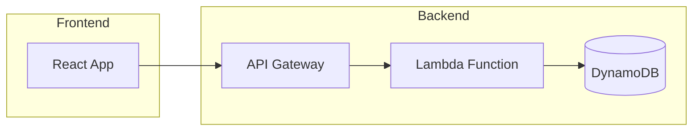
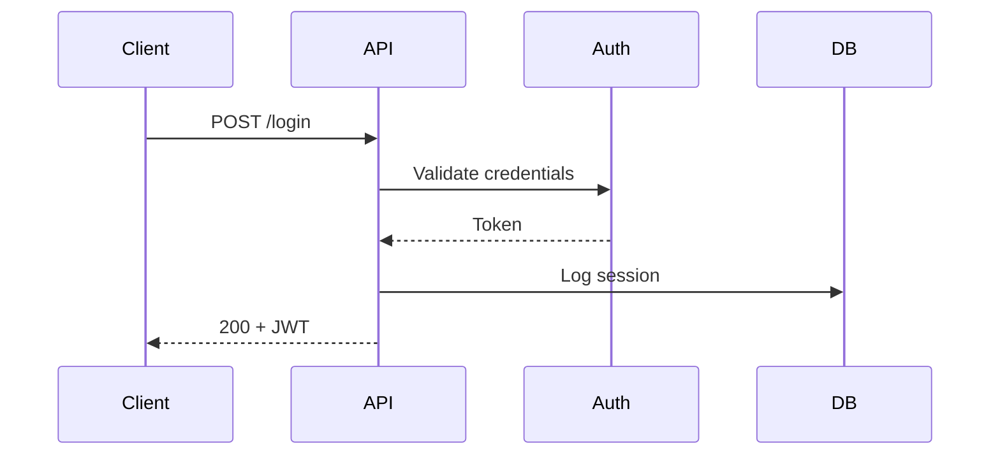
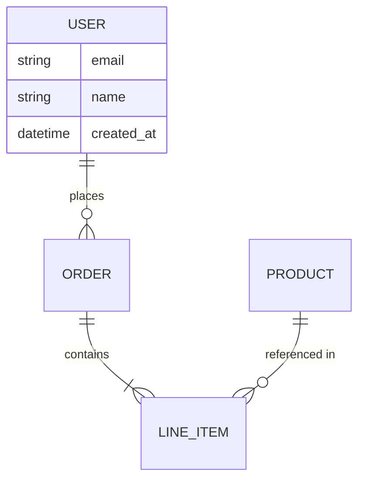
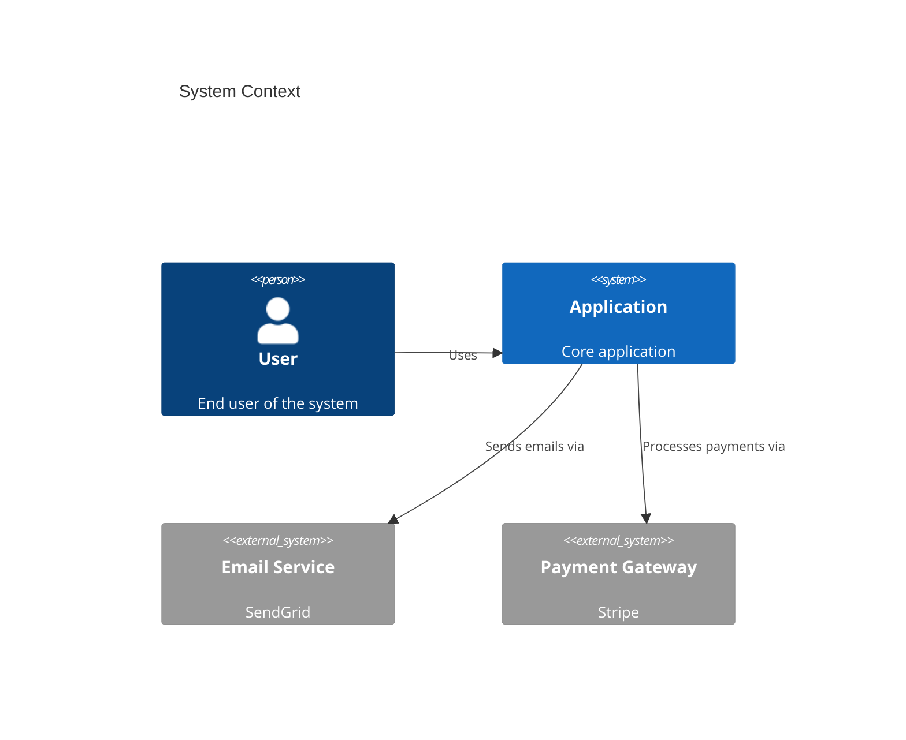

# Architecture Diagrams with Mermaid

Standards for creating, maintaining, and leveraging architecture diagrams across AI-assisted development workflows.

## Why Architecture Diagrams Matter for AI-Assisted Development

Mermaid diagrams serve a **dual purpose**:
1. **Human documentation** — visual understanding of system structure and data flows
2. **AI context-loading** — preloading architecture into the AI's context window leads to faster, more accurate code generation

By maintaining up-to-date diagrams, you give AI coding assistants deep architectural context without repeated file searches.

---

## When to Create or Update Diagrams

| Trigger | Action |
|---------|--------|
| Planning a new feature | Create component and data flow diagrams |
| Implementing significant changes | Review existing diagrams, update if structure changed |
| Refactoring | Create "before" snapshot, then update "after" |
| Code review with architectural changes | Verify diagrams are updated in the PR |
| Documenting a project | Add/update architecture section in README |
| Detecting anti-patterns | Generate dependency graphs to visualize issues |
| Debugging complex flows | Reference diagrams to trace data through components |

---

## Diagram Type Selection Guide

Choose the diagram type that best communicates the architectural concept:

### Flowchart — System & Data Flows
**Use for:** High-level component relationships, data pipelines, request routing, deployment topology



### Sequence Diagram — Service Interactions
**Use for:** API call chains, authentication flows, event-driven workflows, request/response patterns



### Class/ER Diagram — Data Models
**Use for:** Database schemas, object relationships, domain models, inheritance hierarchies



### C4 Context Diagram — Multi-Level Architecture
**Use for:** System boundaries, external integrations, stakeholder communication



### Quick Reference

| Question | Diagram Type |
|----------|-------------|
| What are the main components and how do they connect? | Flowchart |
| What happens when a user does X? (step by step) | Sequence |
| What does the data model look like? | ER Diagram |
| How does the system fit in the broader ecosystem? | C4 Context |
| What classes/modules exist and how do they relate? | Class Diagram |

---

## File Organization

Store diagrams in your project repository for version control:

```
project/
├── docs/
│   └── architecture/
│       ├── system-overview.md        # High-level flowchart
│       ├── api-flows.md              # Sequence diagrams
│       ├── data-model.md             # ER diagrams
│       └── deployment-topology.md    # Infrastructure layout
├── README.md                         # Embed or link key diagrams
└── src/
```

### Naming Conventions

- Use kebab-case: `user-auth-flow.md`, `data-pipeline.md`
- One primary concept per file
- Include a text description above each diagram
- Use `## Architecture` section in README to link to detailed diagrams

---

## Best Practices

### Diagram Quality

- **5-15 nodes per diagram** — split larger systems into multiple focused diagrams
- **Use subgraphs** to group related components and manage visual complexity
- **Descriptive labels** on all nodes and edges — avoid abbreviations
- **Consistent naming** that matches your codebase (same names for services, modules, tables)
- **Brief description** above each diagram explaining what it shows and why
- **Use Mermaid comments** (`%%`) to document non-obvious relationships

### For AI Context-Loading

When creating diagrams that will be read by AI coding assistants:

- **Be explicit** about technology choices in labels (e.g., "Lambda (Python 3.13)" not just "Function")
- **Include data formats** on edges where relevant (e.g., "JSON payload", "SQL query")
- **Name components identically** to their code-level names (module names, class names, table names)
- **Add annotations** for non-obvious patterns:
  ```mermaid
  flowchart LR
      A[API Handler] -->|async| B[Queue]
      B -->|batch of 10| C[Processor]
      %% Processor uses circuit breaker pattern
      C -->|retry 3x| D[External API]
  ```

### Maintenance

- **Update diagrams in the same PR** as architectural code changes
- **Review diagrams during code review** — flag stale diagrams
- **Regenerate periodically** — ask AI to verify diagrams match current code
- **Delete obsolete diagrams** — stale diagrams are worse than no diagrams

---

## Diagram Quality Checklist

Use this checklist when creating or reviewing architecture diagrams:

- [ ] Diagram type matches the concept being communicated
- [ ] 5-15 nodes (not cluttered, not trivial)
- [ ] All nodes and edges have descriptive labels
- [ ] Names match codebase conventions
- [ ] Brief text description above the diagram
- [ ] Renders correctly in Mermaid (validated)
- [ ] Stored in `docs/architecture/` or embedded in README
- [ ] Updated in same PR as related code changes
